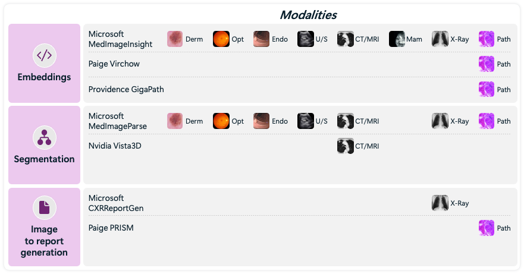
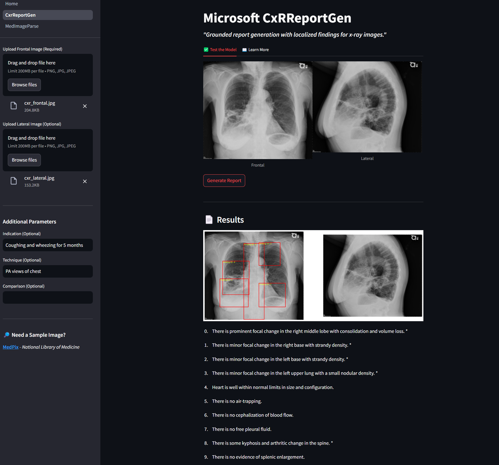
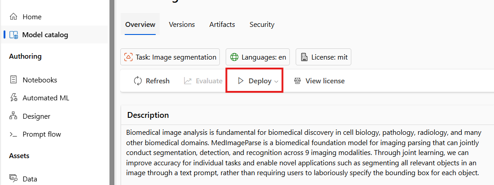

# Foudational Healthcare AI Models

The Azure Model Catalog contains a collection of cutting-edge multimodal medical imaging foundation models developed in collaboration with partners like Providence and Paige.ai. These models enable healthcare organizations to integrate and analyze diverse data types — ranging from medical imaging to genomics and clinical records. By using these advanced models as a foundation, healthcare organizations can rapidly build, fine-tune and deploy AI solutions tailored to their specific needs, all while minimizing the extensive compute and data requirements typically associated with building multimodal models from scratch.

**IMPORTANT NOTE**: These models are not ready for clinical use "as is", but they represent the highest level of performance currently achievable on public benchmarks, outperforming Google’s Med-Gemini, and are pretrained open foundation models that health and life sciences organizations can customize, adapt, and deploy for their specific use cases programatically or through Azure AI Studio. 

<p align="center">
    
</p>


## 📋 In This Repository 

This repository serves as an easy to use demo for the models below. **Bring your own image(s)** and explore the models via an easy to use UI. 

<p align="center">
    
</p>

## ⚕️ Available Models  
  
### **MedImageParse**:  
A biomedical foundation model for imaging parsing that can jointly conduct segmentation, detection, and recognition across 9 imaging modalities. Through joint learning, we can improve accuracy for individual tasks and enable novel applications such as segmenting all relevant objects in an image through a text prompt, rather than requiring users to laboriously specify the bounding box for each object.   
[Read More Here](https://arxiv.org/abs/2405.12971)

### **CxRReportGen**:    
This model is built to help an application interpret complex medical imaging studies of chest X-rays. When built upon and integrated into an application, CXRReportGen may help developers generate comprehensive and structured radiology reports, with visual grounding represented by bounding boxes on the images.   
[Read More Here](https://arxiv.org/abs/2406.04449)

### **Paige.ai PRISM**: (_Coming Soon_)  
A multi-modal generative foundation model for slide-level analysis of H&E-stained histopathology images. Utilizing Virchow tile embeddings and clinical report texts for pre-training, PRISM combines these embeddings into a single slide embedding and generates a text-based diagnostic report. These can be used for tasks such as cancer detection, sub-typing, and biomarker identification.   
[Read More Here](https://paige.ai/paige-introduces-prism-a-slide-level-foundation-model-to-empower-the-next-era-of-pathology-cancer-treatment/)

### **Providence GigaPath**: (_Coming Soon_)   
A whole-slide foundation model for digital pathology. A novel vision transformer architecture for pretraining gigapixel pathology slides. To scale GigaPath for slide-level learning with tens of thousands of image tiles, GigaPath adapts the newly developed LongNet5 method to digital pathology.  
[Read More Here](https://www.nature.com/articles/s41586-024-07441-w)
  
## 🔧 Setup

To get started deploy the model(s) you wish to demonstrate using the Azure Model Catalog  

<p align="center">
    
</p>


Next, setup and activate your conda virtual environment by running
<small>
```bash
conda env create --file=env.yml
conda activate hc-ai
```
</small>

Then, add a [.env](https://pypi.org/project/python-dotenv/) file to the home directory of this repository.
<small>
```txt
MIP_ENDPOINT=<MED IMAGE PARSE ENDPOINT>
MIP_API_KEY=<MED IMAGE PARSE API KEY>
MIP_DEPLOY_NAME=<MED IMAGE PARSE DEPLOYMENT NAME>
.
.
.
(Repeat the same structure for any other model deployments you wish to demo)
```
</small>

Finally, to run the application on localhost execute the following bash command
<small>
```bash
make run_app
```
</small>